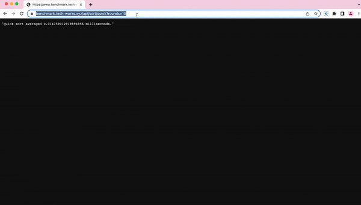

# benchmark-api
 

## Table of Contents 
* [Description](#Descritpion)
* [Installation](#Installation)
* [Usage](#Usage)
* [Application_Demo](#Application_Demo)
* [Technologies](#Technologies)
* [Credits](#Credits)
* [License](#License)
* [Contribution](#Contribution)
* [Contact Information](#ContactInfo)

## Description
A Linux server configured to deploy a sorting benchmark algorithm API using NGINX and configured DNS for the hosted server with a process manager to allow the application run continuously. 

## Installation 
No installation required to run application. 

However, 

To clone program's repo, run the following command line in your terminal/git bash: 

`git clone git@github.com:ifeasome/benchmark-api.git`. 

To view repo, go to: [Application Repo](https://github.com/ifeasome/benchmark-api).

## Usage 
To use this app, change the number at the end of the deployed app link and watch the sorting algorithim change. 

[Deployed App](https://www.benchmark.tech-works.xyz/api/sort/quick?rounds=10)

## Application_Demo 
See Application Demo below:  

## Technologies
Technologies used: 
* Digital Ocean 
* Expressjs
* Namecheap
* NGINX  
* PM2
* Benchmarkjs 

## Credits 
Credit to: Triology Continuing Education Course Modules  

## License
 
 
© 2022 Somelina Obiechina

## Contact Information 
For questions, queries or anything at all, contact me at: 

Github: [https://github.com/ifeasome](https://github.com/ifeasome) 

Email: [ifeasome@gmail.com](ifeasome@gmail.com)

